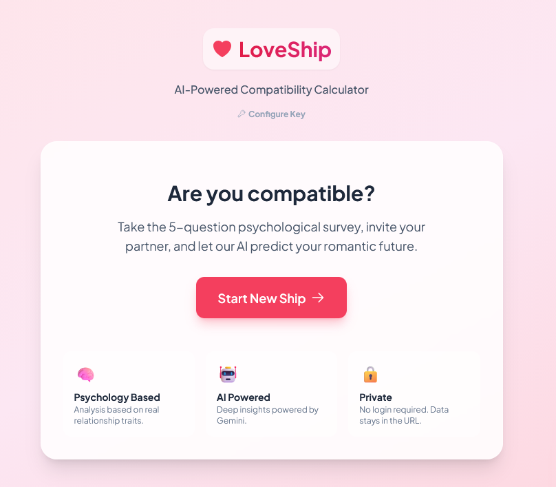

<div align="center">


# LoveShip 💘

**LoveShip** is an AI-powered romantic compatibility calculator that goes beyond simple zodiac signs. It invites couples to take a psychological deep-dive survey, then uses Google's Gemini AI to analyze their synergy, predict their future, and offer relationship advice.

 ✨ **100% AI-Generated Code**
> **Note:** This entire application—including all logic, UI design, styling, and documentation—was written exclusively by **Google Gemini**, with no manual coding by human developers.

</div>

---

## 🚀 Features

- **Psychological Analysis:** A 5-question survey designed to reveal core relationship traits.
- **AI-Powered Compatibility:** Uses Gemini to analyze partner responses and generate a detailed report including:
  - **Compatibility Score:** A percentage-based match rating.
  - **Relationship Forecast:** A witty prediction of your future.
  - **Strengths & Challenges:** Deep insights into what makes you tick (and what might tick you off).
- **Privacy First:** No login required. All data is encoded directly into the URL hash. Your answers are never stored on a database.
- **"Bring Your Own Key" (BYOK):** Users enter their own Gemini API key, stored securely in local storage, ensuring privacy and preventing rate limits.
- **Social Sharing:**
  - Share unique invite links with partners.
  - Generate beautifully formatted "manual embeds" for Discord sharing.
  - Share final result links with friends.
- **Modern UI:** A romantic, mobile-first interface featuring glassmorphism, smooth animations, and reactive state management.

## 🛠️ Tech Stack

- **Frontend:** React + TypeScript + Vite
- **Styling:** Tailwind CSS (via CDN)
- **AI Integration:** Google GenAI SDK (`@google/genai`)
- **Icons:** Custom SVG Components

## 🏁 Getting Started

### Prerequisites
- Node.js (v18 or higher)
- npm
- A [Google Gemini API Key](https://aistudio.google.com/app/apikey)

### Installation

1. **Clone the repository:**
   ```bash
   git clone <repository-url>
   cd loveship
   ```

2. **Install dependencies:**
   ```bash
   npm install
   ```

3. **Run the development server:**
   ```bash
   npm run dev
   ```
   The app will run on `http://localhost:8083` (check your console for the exact port).

4. **Enter API Key:**
   When you first open the app, click the key icon or "Set API Key" to enter your Gemini API Key. This is required for the AI analysis to work.

## 📖 How to Use

1. **User A (The Initiator):**
   - Click **Start New Ship**.
   - Answer the 5 psychological questions about yourself.
   - Copy the generated **Invite Link** and send it to your partner.
2. **User B (The Partner):**
   - Open the link sent by User A.
   - Click **Accept Challenge**.
   - Answer the same set of questions.
3. **The Reveal:**
   - Once User B finishes, the AI analyzes both profiles.
   - A compatibility report is displayed instantly.
4. **Share:**
   - Use the **Copy Discord Embed** button to paste a cool summary into your favorite Discord server.

## 🤖 "Made with Gemini" Disclaimer

This project serves as a demonstration of the capabilities of **Gemini 2.0 Flash** acting as an autonomous software engineer. Every line of code, from the React components to the CSS styling and API integration logic, was generated by the model in response to high-level user instructions.

---
<div align="center">
  <p>Run and deploy your AI Studio app</p>
</div>